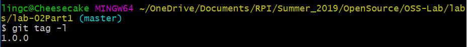

# Part 1
Link to lab2part1: https://github.com/LingCheng3273/OSS-Lab2Part1 

gitk Picture: 
git log Picture: 

# Part 2
My Spoon-Knife fork: https://github.com/LingCheng3273/Spoon-Knife

Introduction Sequence: 

# Part 3
My PullRequest fork: https://github.com/LingCheng3273/PullReq

git diff: 
git tag -l: 
Link to OSSProjectIdeas repo: https://github.com/prashb99/OSSProjectIdeas

